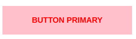
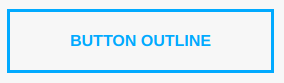

# CSS Modules


## ¿Qué es?


Según el [repositorio](https://github.com/css-modules/css-modules), *CSS modules* son:

​     **Archivos CSS en los que los nombres de las clases y los nombres de las animaciones tienen un alcance local de forma predeterminada.**

Por lo tanto, *CSS modules* no es una especificación oficial ni una implementación en el navegador, sino más bien un proceso en un paso de compilación (con la ayuda de Webpack , Gulp, Rollup, Parcel o Browserify) que cambia los nombres de clase y los selectores que se van a definir.


```html
<button class="button">common button</button>
```


`button.css`

```css
.button {
    text-transform: uppercase;
    font-size: 16px;
    font-weight: 600;
    border-radius: 0;
    padding: 20px 60px;
    border: none;
}
```


`button.js React`

```javascript
import styles from "./button.css";

element.innerHTML = 
  `<button class="${styles.button}">
     common button
   </button>`;
```


Y el código generado sería:


`html`

```html
<button class="_styles__button_309571057">
  COMMON BUTTON
</button>
```


`output css`

```css
._styles__button_309571057 {
    text-transform: uppercase;
    font-size: 16px;
    font-weight: 600;
    border-radius: 0;
    padding: 20px 60px;
    border: none;
}
```


## ¿Qué problema resuelve?


 ### El scope global en css


* ¿Alguna vez os habéis sentido tentados por la falta de tiempo o recursos para simplemente escribir CSS lo más rápido posible, sin considerar qué más podría afectar? 
* ¿Alguna vez has añadido reglas en la parte inferior de una hoja de estilo, con la intención de organizarse pero nunca hacerlo? 
* ¿Alguna vez te has topado con estilos en los que no estabas completamente seguro de lo que hacían o si estaban siendo utilizados? 
* ¿Alguna vez te has preguntado si podrías deshacerte de algunos estilos sin romper algo? 
* ¿Alguna vez os preguntsteis si los estilos dependían de otras estilos? 
* ¿Algun vez sobreescribisteis estilos en otra parte?


Con los módulos CSS y el concepto de ámbito local por defecto, se evitan estos problema.


## ¿Cómo lo resuelve?


Con *CSS modules*, es una garantía de que todos los estilos de un componente: 

- Viven en un solo lugar

- Solo se aplican a ese componente y nada más. 

- Inyección de dependencias.

  

## ¿Cómo funciona?


Para utilizar CSS modules, necesitamos *importar los estilos*. Este proceso de importación se hace **a través de loaders javascript**, escritos para cada determinado bundler system (webpack, parcel, rollup, gulp etc...) Este proceso genera un namespace del tipo *filename_class_hash* con todas las clases importadas. Al igual que con las importaciones normales, css-loader inyectará también su hoja de estilo con las reglas para las clases construidas con namespace en el documento. La gran diferencia aquí es que la importación nos devuelve un objeto diccionario  de nombres de *clases locales* a sus versiones con namespace.


### Ejemplo

`foo.css`

```css
.foo {
    padding: 10px;

    header.bar {
        color: black;
        font-size: 200%;
    }
}
```

`foo.js`

```javascript
import style from './style.less';

export default class Foo extends Component {  
    render() {
        return (
            <div class={ style.foo }>
                <header class={ style.bar }>Sup</header>
                etc
            </div>
        );
    }
}
```

`console`

```shell
console.log(style);  
{ foo:"foo_foo_abcde", bar:"foo_bar_abcde" }
```

`real styles injected in bundle.css`

```css
.foo_foo_abcde {
    padding: 10px;
}

.foo_bar_abcde {
    color: black;
    font-size: 200%;
}
```


## Composición vs Herencia


### Herencia


> **Un objeto o clase se basa en otro objeto o clase, usando la misma implementación o comportamiento**


Esto es un mecanismo para la reutilización de código para permitirnos extensiones independientes del software original mediante clases públicas e interfaces.


Ejemplo:


`css`

```css
.button {
    border-radius: 0;
    height: 50px;
    padding: 8px 16px;
    font-size: 16px;
    text-transform: uppercase;
}

.red {
   background: red;
   color: white;
}

.blue {
   background: blue;
   color: white;
}
```


`html`

```html
<button class="button">
    button
</button>

<button class="button red">
    button red 
</button>

<button class="button blue">
    button blue
</button>
```


En el ejemplo hemos compuesto tres objetos el segundo y tercero están usando para ello la implementación del primero del primero, es decir, su implementaión no es independiente a ésta.


En principio parece que el lenguage css básado en la herencia de cascada de estilos está diseñado para usar  este tipo de patrón, pero vamos a ver que con la llegada de los preprocesadores y herramientas como css modules o styles in js eso ya no es una limitación.


### Composición


> **Composición quiere decir que tenemos una instancia de una clase que contiene instancias de otras clases que implementan las funciones deseadas.**


Estamos delegando las tareas que nos mandan a hacer a aquella pieza de código que sabe hacerlas. El código que ejecuta esa tarea concreta está sólo en esa pieza y todos delegan el ella para ejecutar dicha tarea. Por lo tanto estamos reutilizando código de nuevo.


Veámos como se implemena la composición con diferentes opciones:


#### CSS Modules

`source`

```css
.button {
    border-radius: 0;
    height: 50px;
    padding: 8px 16px;
    font-size: 16px;
    text-transform: uppercase;
}

.buttonPrimary {
    composes: button;
    background: red;
    color: white;
}

.buttonSecondary {
    composes: button;
    background: blue;
    color: white;
}
```


`output`   

```css
.button {
    border-radius: 0;
    height: 50px;
    padding: 8px 16px;
    font-size: 16px;
    text-transform: uppercase;
}

.buttonPrimary {
    border-radius: 0;
    height: 50px;
    padding: 8px 16px;
    font-size: 16px;
    text-transform: uppercase;
    background: red;
    color: white;
}

.buttonSecondary {
    border-radius: 0;
    height: 50px;
    padding: 8px 16px;
    font-size: 16px;
    text-transform: uppercase;
    background: blue;
    color: white;
}
```


Puede haber múltiples reglas de composición, pero las reglas de composición deben estar antes que otras reglas. 

En el ejemplo hemos compuesto tres objetos cada uno con su implementación independiente, la del segundo y tercero con una instancia del primero.


#### Preprocesadores


##### Sass


##### Less


## Integración con bundlers


## Ejemplo a maquetar


Vamos  a maquetar con *CSS modules* tres componentes  `btnPrimary`, `btnSecondary` `btnOutline`


Para esto vamos a definir el proceso por pasos:


1. Identificar definir e implementar las variables de tema en un archivo theme.css

2. Identificar las propiedades comunes entre todos los componentes e implementar sus reglas de estilo en un cuatro componente commun a todos `btnBase` que constará de los archivos `btnBase.js` y `btnBase.css`

   

   Propiedades a conocer:

   * `padding: 20px 60px` 

   * `font-size: 16px`

   * `font-weight: 600`

   

​       


3. Implementar un componente `btnPrimary`  en el que Compondremos las reglas definias para el componente `btnBase` añadiendo sus propiedades propias. el componente `btnPrimary` constará de los ficheros `btnPrimary.css` y `btnPrimary.js`

   

   Propiedades a conocer:

   - `color: red` 

   - `background: pink`


​       


4. Implementar un componente `btnSecondary`  en el que Compondremos las reglas definias para el componente `btnBase` añadiendo sus propiedades propias. el componente `btnSecondary` constará de los ficheros `btnSecondary.css` y `btnSecondary.js`

   

   Propiedades a conocer:

   - `color: white  `
   - `background: #00aaff`

   

​       


5. Implementar un componente `btnOutline`  en el que Compondremos las reglas definias para el componente `btnBase` añadiendo sus propiedades propias. el componente `btnOutline` constará de los ficheros `btnOutline.css` y `btnOutline.js`

   

   Propiedades a conocer:

   - `color: #00aaff` 
   - `boder: 3px solid #00aaff`
   - `background: transparent`

   

​       

